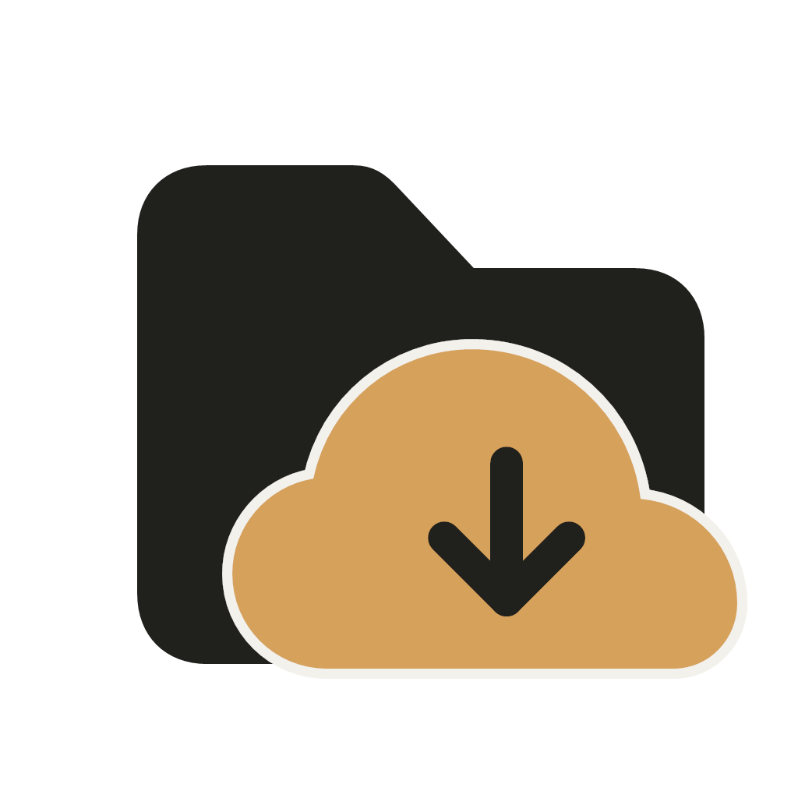
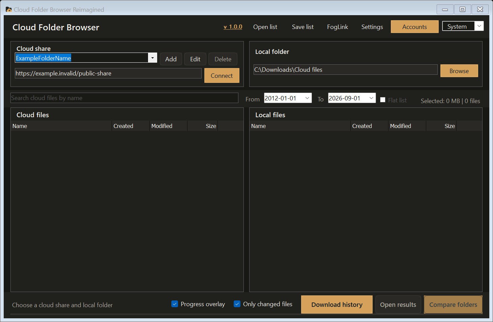

<div align="center">
  
  <h1>Cloud Folder Browser Reimagined</h1>
  <p>A Windows desktop application for browsing public cloud folders, comparing them with local storage, and downloading only what is needed.</p>
  <p>
    <a href="https://github.com/Halo1211/cloud-folder-browser-reimagined/releases/latest"></a>
    <a href="https://github.com/Halo1211/cloud-folder-browser-reimagined/actions/workflows/ci.yml"></a>
    <a href="LICENSE"></a>
    <a href="#requirements"></a>
  </p>
</div>



This fork keeps the original Cloud Folder Browser workflow—load a shared folder, inspect its contents, compare it with a local directory, and download missing files—while extending it into a multi-provider sync and transfer tool.

## What is new in v1.0

### Multi-cloud accounts and download routing

- Encrypted account storage for MEGA, Yandex Disk, WebDAV, Dropbox, Google Drive, AllDebrid, Real-Debrid, Debrid-Link, Premiumize.me, and TorBox.
- Independent active accounts per provider.
- Automatic routing that prefers native or direct downloads and falls back to eligible debrid accounts when required.
- Per-host scoring and cooldowns to avoid repeatedly selecting a provider that is failing.
- Portable provider plug-ins through the versioned `ICloudFolderProviderV2` contract.

### Resumable, verified transfers

- HTTP `.part` resume with size validation before completion.
- Optional multi-segment downloads for files of at least 16 MiB, with safe fallback when a server does not implement byte ranges correctly.
- Persistent 8 MiB byte maps so completed segments can survive retries and worker-count changes.
- Remote checksum support for `Digest`, `Content-MD5`, and `x-goog-hash: md5` headers.
- Fair per-host scheduling, transfer priorities, a shared bandwidth limit, live speed, and ETA.
- Persistent download history with pause, resume, and retry controls.

### Safer folder synchronization

- A review step before files are written to disk.
- Per-file actions: **Download**, **Overwrite**, **Skip**, or **Rename**.
- Optional SHA-256 manifests for detecting local corruption.
- ZIP extraction with path-traversal protection, plus optional 7-Zip and PAR2 integration.

### Network and privacy controls

- System, UDP, DNS-over-HTTPS, and DNS-over-TLS resolution with Cloudflare, Google, Quad9, AdGuard, or a custom endpoint.
- Direct, system, HTTP(S), SOCKS4/4a, and SOCKS5 proxy modes.
- Per-provider proxy rules, connection diagnostics, and provider health checks.
- Windows user-scoped encryption for saved credentials, source URLs, tokens, and proxy passwords.
- Password-encrypted `.cfbackup` export and import for settings and accounts.

### Updated desktop experience

- System, light, and dark themes remembered between launches.
- A clearer two-pane browser and sync review flow.
- New application icon and an amber loading indicator aligned with the charcoal-and-amber interface.
- Consistent application branding across the main window, dialogs, executable, and release metadata.

## Supported sources

| Source | Public links | Account browsing | Notes |
| --- | :---: | :---: | --- |
| MEGA | Yes | Yes | Native transfers or an eligible debrid route |
| AllSync / Qloud | Yes | — | Password-protected shares and resumable WebDAV downloads |
| Yandex Disk | Yes | Yes | Public shares and token-based imports |
| WebDAV | — | Yes | Includes compatible Nextcloud and ownCloud endpoints |
| Dropbox | Yes | Token | Public files/folders; private access requires a user-supplied token |
| Google Drive | Yes | Token | Files plus Docs, Sheets, and Slides exports |
| TeraBox | Yes | — | Resolved through a configured debrid account |
| Generic HTTP(S) | Yes | — | Direct files and supported hoster links |
| h5ai / The Trove | Yes | — | Portable public-folder providers |

Cloud Folder Browser does not ship shared OAuth client secrets and does not bypass provider policies. Availability still depends on each provider, account plan, and supported host list.

## Download and first run

1. Download `CloudFolderBrowser.exe` from the [latest release](https://github.com/Halo1211/cloud-folder-browser-reimagined/releases/latest).
2. Place it in a writable folder. Keep `CloudFolderBrowser.dll.config` beside it when using the portable package.
3. Open the application, add a cloud share, and choose a local folder.
4. Select the remote folders you want, then choose **Compare folders**.
5. Review the proposed actions before starting the transfer.

Windows may display a SmartScreen warning for unsigned community builds. Check the published SHA-256 file before running the executable.

## Requirements

- Windows 10 or Windows 11, x64.
- The self-contained release does not require a separate .NET installation.
- Building from source requires the .NET 9 SDK selected by [`global.json`](global.json).

Optional integrations:

- [FlareSolverr](https://github.com/FlareSolverr/FlareSolverr) for supported shares protected by a browser challenge.
- JDownloader 2 for exported link packages.
- 7-Zip for RAR, 7z, and password-protected archive extraction.
- PAR2 command-line tools for optional repair.

## Build from source

```powershell
git clone https://github.com/Halo1211/cloud-folder-browser-reimagined.git
cd cloud-folder-browser-reimagined
dotnet restore CloudFolderBrowser.sln
dotnet test CloudFolderBrowser.Tests/CloudFolderBrowser.Tests.csproj -c Release --no-restore
dotnet build CloudFolderBrowser.sln -c Release --no-restore
```

Create the same self-contained Windows x64 package used for releases:

```powershell
./tools/Build-Release.ps1
```

The script clears previous local release outputs, runs the test suite, publishes a single-file executable, creates a ZIP package, and writes SHA-256 checksums under `release/`.

## Data locations and security notes

Account data, download history, integrity manifests, and application state are stored under `%LOCALAPPDATA%\CloudFolderBrowser`. Sensitive values are protected for the current Windows user. An exported `.cfbackup` is encrypted with a password-derived AES-GCM key; a forgotten backup password cannot be recovered.

Provider plug-ins execute inside the application process. Install DLLs only from sources you trust. A dedicated load context isolates dependency resolution, but it is not a security sandbox.

## Provider plug-ins

Additional providers can be placed in a `Providers` directory beside the executable. A plug-in must implement `ICloudFolderProviderV2` and expose a public parameterless constructor. The v1 interface remains supported for compatibility.

See [CONTRIBUTING.md](CONTRIBUTING.md) for the local development workflow and pull-request expectations.

## Project history

Cloud Folder Browser Reimagined is a fork of [ptrsuder/cloud-folder-browser](https://github.com/ptrsuder/cloud-folder-browser). The original provider integrations and folder-comparison workflow remain the foundation of this project. The v1.0 release adds the account system, portable providers, transfer engine, sync review, network controls, tests, current interface, and release tooling described above.

## License

Distributed under the GNU General Public License v3.0. See [LICENSE](LICENSE).
